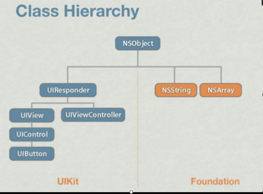
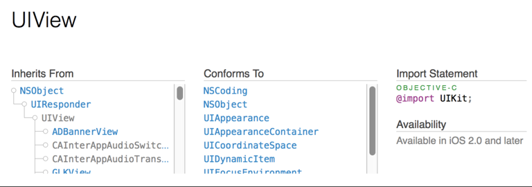

# W1D3-May-2017

### Outline
  - Git ignore global connecting it up by running this command: 
  `git config --global core.excludesfile ~/.gitignore_global`
  - Inheritance
  - self vs super
  - Interface vs Implementation
  - Encapsulation
  - nil and friends
  - NS(Mutable)Dictionary

## Inheritance
[wikipedia article](https://en.wikipedia.org/wiki/Inheritance_(object-oriented_programming) )

#### What is inheritance? 
- When one class gets some subset of properties and/or method implementations from a parent class. 
- Classes can inherit behavior and attributes from its parents just like we do!

#### Why is it a good thing?
- It lets us reuse code. Why is this important?
- It allows us to extend the functionality of classes already written by us or by others. (Without inheritance we wouldn't be writing iOS apps at all).
- It gives us a means of abstraction which allows us to use polymorphism.

>"Polymorphism is when you can treat an object as a generic version of something, but when you access it, the code determines which exact type it is and calls the associated code." [StackOverflow](http://stackoverflow.com/a/3110318/951349)

- We will look at an example of polymorphism in a couple of minutes.

#### Inheritance vs object composition
- Inheritance contrasts with object composition.
- Composition is where a class gets behavior or attributes from other objects that are passed in to it (injected), or instantiated internally.
- This is, many classes are complex not just by inheriting behavior by they can also be made up of (composed of) other classes.
- By analogy, you also didn't just inherit everything you are from your parents. 
- Some of it you went out and got or it was handed to you by others. 
- For instance, you probably didn't inherit  (in the biological sense) your fascination for iPhones. It was something you acquired.

#### Why Is Inheritance Important to Understand?
- It's a central concept in OOP.
- You need to understand inheritance to interact with CocoaTouch.
- Much of your code in iOS will start by subclassing CocoaTouch classes.
- Actually individual CocoaTouch classes themselves usually consist of big inheritance trees.
- For instance, we know that all classes in Objective-C descend from NSObject. 
- This is where we get alloc and init from.
- Also, most iOS apps are made up of custom ViewControllers that all start by subclassing Apple's UIViewController class.
- Inheritance is absolutely everywhere!

- If you want to read and comprehend Apple's documentation you need to understand inheritance.

### What's Bad About Inheritance?
- Like everything good there is a down side. Inheritance is no different.
- You won't go far as a programmer before you hear that you should "prefer composition over inheritance". Why is this?
- Can make code complex to understand.
- The code we're running might be sitting in a super class far removed up the hierarchy from where it is running.
- Inheriting an implementation of a method creates a dependency between the subclass and the chain of super classes above it. 
- This means that your subclass gets all of the public properties and method implementations whether this makes sense or not! You might have to override stuff and do nothing! (It's all or nothing.)
- Changes to the superclass propogate automatically down and might have an adverse impact on subclasses.
- It can make code hard to maintain.
- There are better mechanisms to get the benefits of inheritance without the down sides using object composition.

### `self` vs `super`
- Classes often want to call methods or set properties on themselves (the instance).
- For this we use use `self`. (Some languages use  `this`).
- When you want to call something on your super class you call `super`.
- `self` stands for the *current instance*.
- `super` stands for the *current instance*'s `superclass` instance (i.e. your immediate parent).
- You mostly only use `super` when you override a method and want to get the super class's implementation too. 

> Note: Check the documentation when overriding Apple's methods to see whether you are expected to call super. If you omit a call to super expect weirdness.

**[ Inheritance & Composition Demos]**

### `interface` vs `implementation` files

- By convention the name of a class's file matches the name of the class. (This is not enforced like Java). E.g. The name of the class Person is by convention Person.m and Person.h.
- Objc uses 2 files by convention to represent a class. You could put them both in 1 file if you wanted, or you could even put many classes in 1 file.
- Objc separates out an interface and an implementation like C and C++.
- Whatever is declared in the interface is public (except Instance Variables `IVARS`).
- We will learn about how to declare properties that can only be seen internally later (I think next week) when we talk about categories. (It's just a separate interface in the .m file).
- Note in modern Objc you never need to declare methods as private in a separate interface.
- Properties are just conveniences and were added to 2.0 (2006). 
- The compiler defines as a setter and getter method (assuming it is readwrite) and a backing store.
- The backing store is private and cannot normally be accessed from outside the class directly.
- To access it, that is, to set it or get it, you must call the property using `.` notation or method notation. (dot notation was added in 2.0 and is just a convenience, but always prefer dot notation for properties).
- The fact that instance variables are hidden by design is an expression of a principle in OOP known as `encapsulation`.

### Encapsulation
[Wikipedia Article](https://en.wikipedia.org/wiki/Encapsulation_(computer_programming))

#### 2 distinct senses:

1) A language mechanism for restricting direct access to some of the object's components.

2) A language construct (in Objc this is a class) that facilitates the bundling of data with the methods (or other functions) operating on that data.

**[ Encapsulation/Properties demo ]**

## `nil`, `Nil`, `NULL`, `NSNULL`

- These are ways of representing nothing in Objective-C/C.

- C represents nothing as 0 for primitives and NULL for pointers.

- Objective-C represents object instances that are nothing as nil.

- nil is a pointer to nothing.

- You can't add nil to a collection in Objc, since nil is not an object.

- There is a wrapper object in Foundation `NSNull`. You create it by calling the `[NSNull null]` class method.

- `Nil` (with a capital) is a class pointer to nothing, but I've never used it.

- You can send a message to `nil` in Objc without crashing. This is the source of a great many errors and Swift is obsessed with correcting this.

- Main take aways. 
    - Use `nil` for the absence of an object instance. 
    - Avoid using `NULL` (for C pointers) unless you know why you're using it. 
    - Primitives can represent no value using 0. (DANGER ZONE)
    - Use the wrapper `[NSNull null]` to add nil to a collection.

>[NSHipster nil discussion](http://nshipster.com/nil/) 

**[ nil Demo ]**

## NSDictionary
- What is a dictionary?
- It stores 0 or many key value pairs.
- It is unordered unlike an array.
- Each key must be unique.
- Values are accessed by the key.
- It is accessible using subscripting notation added in Objc 2.0.  `dict[@"someKey"]`
- If you attempt to access a value using a key and it doesn't exist the expression evaluates to nil.
- In Objc `NSDictionary` is heterogeneous, meaning that it can be of mixed types.
- This is rarely what you want. 
- So, you can specify the types using light weight generics in modern Objc.

`NSDictionary<NSString*,NSString*> *d = @{@"key" : @"value"};`

- When should you use a dictionary vs a class?
- With dictionaries we can add arbitrary keys at runtime unlike a class. (mutable version only!)
- Don't use them where you should be using classes. (Prefer classes).

## NSMutableDictionary
- Subclasses `NSDictionary`.
- It allows you to add new key value pairs or remove existing ones.

**[ NSDictionary Demo ]**

> Look at NSDictionary documentation. This is good practice using the docs.

## Let's Look at Today's Assignments

